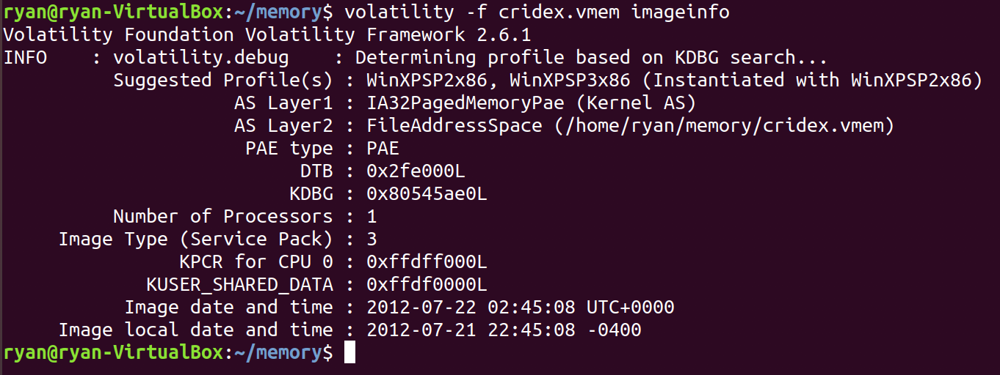
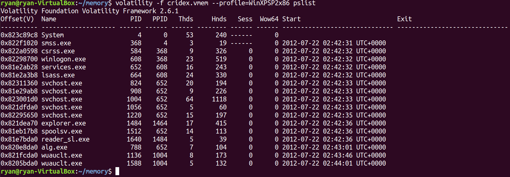
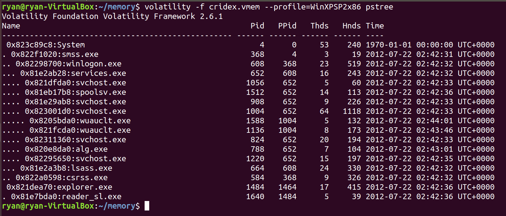
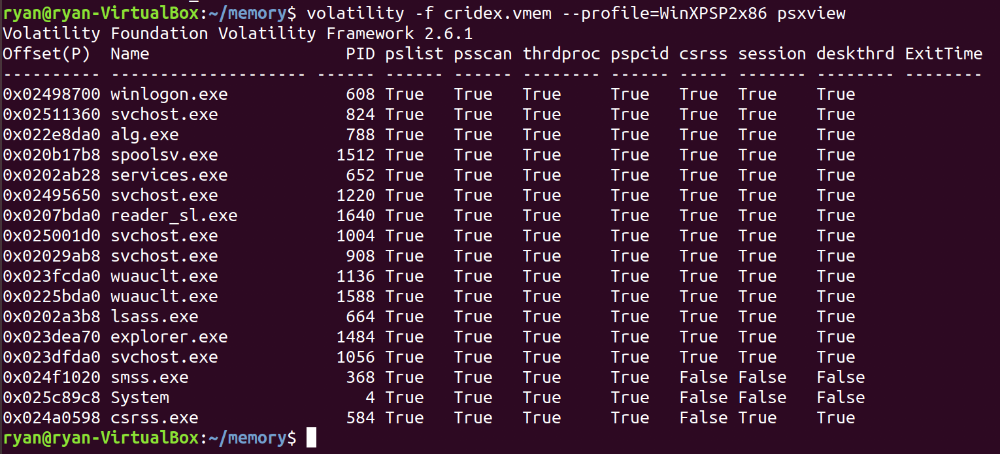
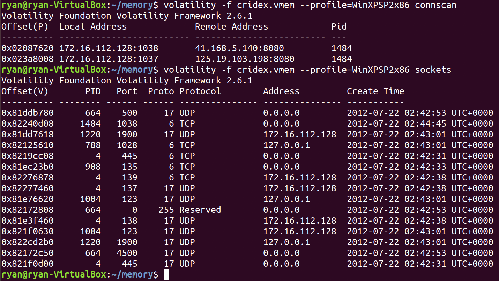

This document was written based on "https://medium.com/@zemelusa/first-steps-to-volatile-memory-analysis-dcbd4d2d56a1".   
The purpose of this document is to review and record what I've studied.


### Prerequisite
- Install volatility
- The dump I analyzed : [The Cridex malware](https://github.com/volatilityfoundation/volatility/wiki/Memory-Samples)


### Dump analysis 

#### Begine
`imageinfo`: get more information about the memory dump.   
`-f` : specifies the dump file

```
$ volatility -f cridex.vmem imageinfo
```

result: 

</img><br/>


computer OS from which this memory dump comes from : WinXPSP2x86

#### What were the running processes? 

`--profile=` : specifies to volatility the OS profile   
`pslist` : the running process list  

```
$ volatility -f cridex.vmem --profile=WinXPSP2x86 pslist
```

result: 

</img><br/>


`pstree` display the processes and their parent processes
```
$ volatility -f cridex.vmem --profile=WinXPSP2x86 pstree
```

result: 

</img><br/>


We can notice that an odd process named "reader_sl.exe" with the "explorer.exe" as parent process(PPID).


`psxview`: list processes that are trying to hide themselves while running on the computer.   
If a process tries to hide itself, the first two colums(__pslist__ and __psscan__) should be "False".   
In this case, there are no such process.   

```
$ volatility -f cridex.vmem --profile=WinXPSP2x86 psxview
```

result:

</img><br/>


#### Checking ther unning sockets and open connections on the computer
`connscan` : a scanner for TCP connections  
`netscan` : print a list of open sockets  
`sockets` : scan a Vista image for connections and sockets  

```
$ volatility -f cridex.vmem --profile=WinXPSP2x86 connscan
```
```
$ volatility -f cridex.vmem --profile=WinXPSP2x86 sockets
```

result: 

</img><br/>


In this scenario, two TCP connections are used by the process with PID 1484 (exploer.exe).  
This one of this TCP connection is still open.   
The one using port 1038 and communicating with the destination IP address 41.168.5.140   


