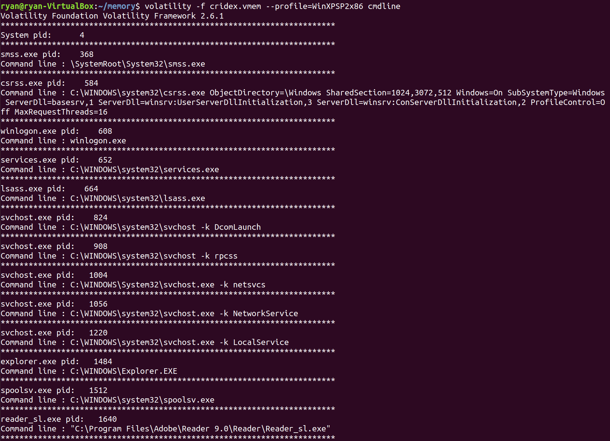
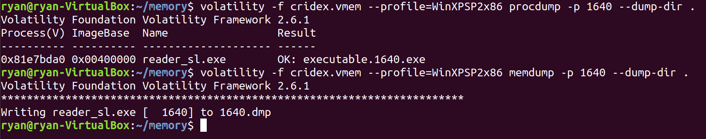
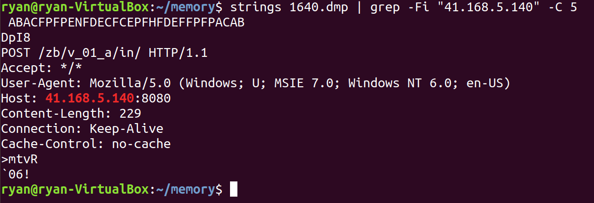
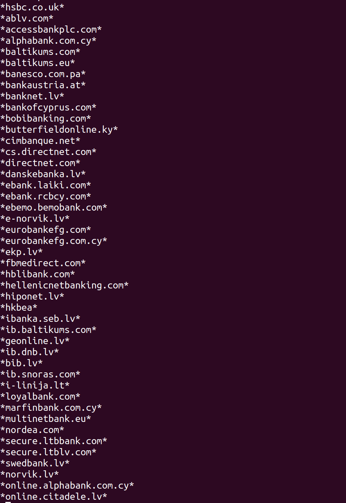
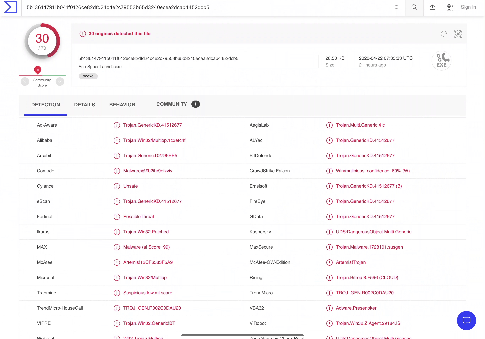
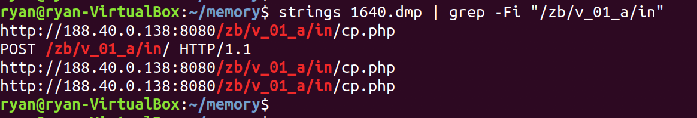
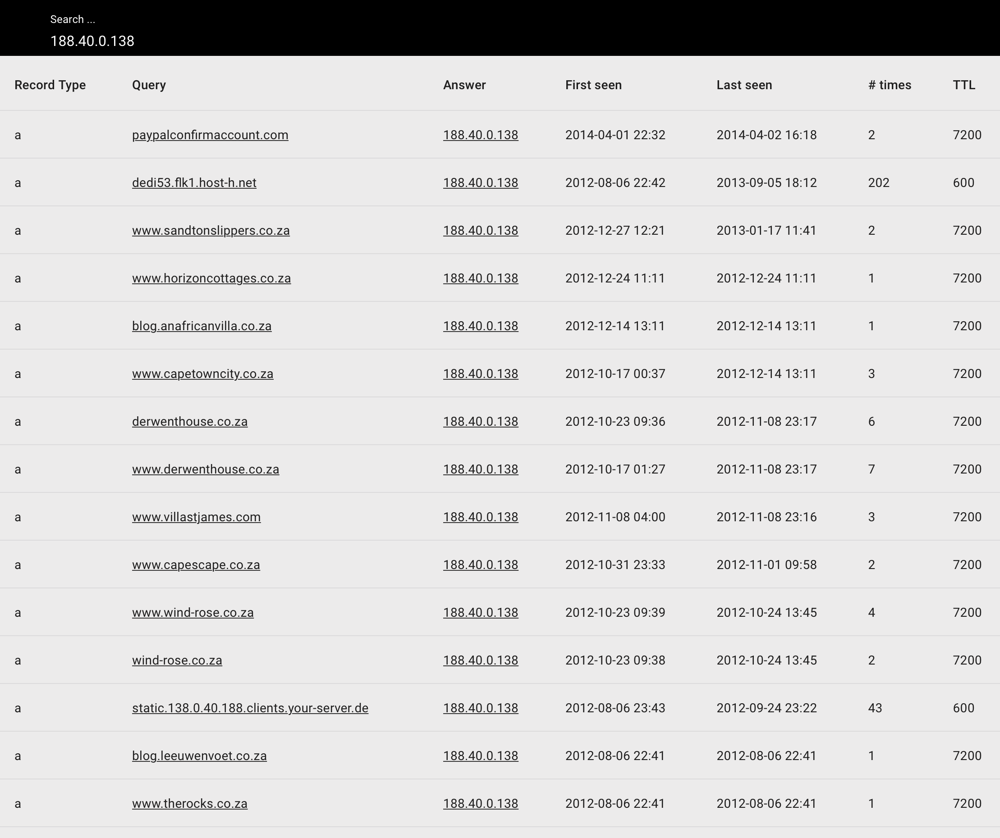
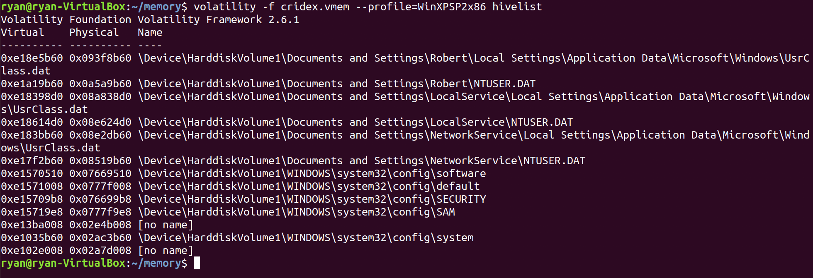
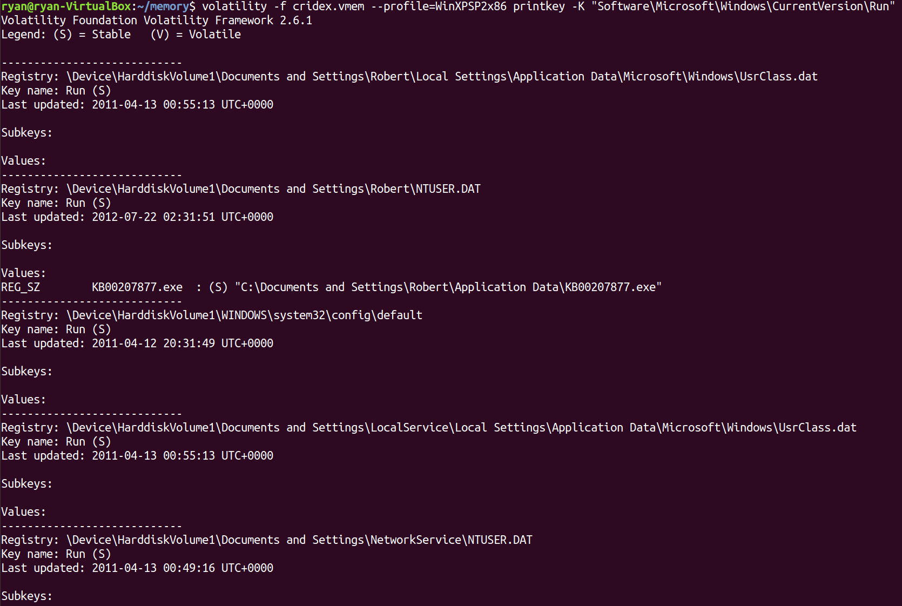
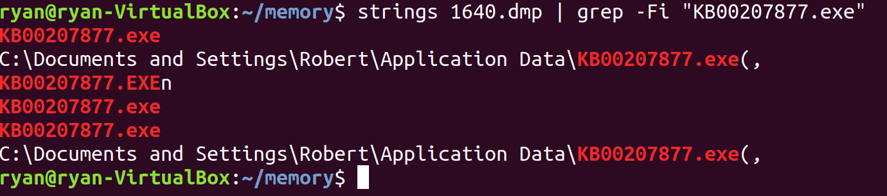

This document was written based on [@zemelusa](https://medium.com/@zemelusa/first-steps-to-volatile-memory-analysis-dcbd4d2d56a1)   
The purpose of this document is to review and record what I've studied.


### Prerequisite
- Install volatility
- The dump I analyzed : [The Cridex malware](https://github.com/volatilityfoundation/volatility/wiki/Memory-Samples)


### Dump analysis 

#### Begine
`imageinfo`: get more information about the memory dump.   
`-f` : specifies the dump file

```
$ volatility -f cridex.vmem imageinfo
```

result: 

</img><br/>


computer OS from which this memory dump comes from : WinXPSP2x86

#### What were the running processes? 

`--profile=` : specifies to volatility the OS profile   
`pslist` : the running process list  

```
$ volatility -f cridex.vmem --profile=WinXPSP2x86 pslist
```

result: 

</img><br/>


`pstree` display the processes and their parent processes
```
$ volatility -f cridex.vmem --profile=WinXPSP2x86 pstree
```

result: 

</img><br/>


We can notice that an odd process named "reader_sl.exe" with the "explorer.exe" as parent process(PPID).


`psxview`: list processes that are trying to hide themselves while running on the computer.   
If a process tries to hide itself, the first two colums(__pslist__ and __psscan__) should be "False".   
In this case, there are no such process.   

```
$ volatility -f cridex.vmem --profile=WinXPSP2x86 psxview
```

result:

</img><br/>


#### Checking ther unning sockets and open connections on the computer
`connscan` : a scanner for TCP connections  
`netscan` : print a list of open sockets  
`sockets` : scan a Vista image for connections and sockets  

```
$ volatility -f cridex.vmem --profile=WinXPSP2x86 connscan
```
```
$ volatility -f cridex.vmem --profile=WinXPSP2x86 sockets
```

result: 

</img><br/>


In this scenario, two TCP connections are used by the process with PID 1484 (exploer.exe).  
This one of this TCP connection is still open.   
The one using port 1038 and communicating with the destination IP address 41.168.5.140   


### Taking a look at the last commands ran 
`cmdscan` : extracts command history by scanning for _COMMAND_HISTORY
`consoles` : extracts command history by scanning for _CONSOLE_INFORMATION
`cmdline`  : display process command-line arguments

</img><br/>


the `consoles` and `cmdscan` did not contain any information in their buffers. 

Throguh `cmdline` plusin, we now have the full path of the proecsses launched with PID 1484 and 1640. 
The "Reader_sl.exe" process is becoming more suspicious. 


So far, 
 - This process was launched by the explorer process 
 - This process is supposed to be a classic Adobe reader application 
 - However, it has a running connection towards an external IP used by this very same process
 


### Checking the concerned executable and the analysis

`procdump`   
`memdump`  
 
option `-p` : PID
option `--dump-dir` : the directory where we want to extract these dumps

```
$ volatility -f cridex.vmem --profile=WinXPSP2x86 procdump -p 1640 --dump-dir .
```
```
$volatility -f cridex.vmem --profile=WinXPSP2x86 memdump -p 1640 --dump-dir .
```

</img><br/>


`executable.1640.exe` : a restitution of the executable "Reader_sl.exe" 
`1640.dmp` : the addressable memory of the process


A simple analysis of these fiels can be done by using the `strings` linux command.

In this scenario, we are looking for a relation between the piece of information already retrieved from the dump(especially the opened TCP connection towards the 41.168.4.140 IP) and this 1640 process. 

</img><br/>

I used __grep__ command combined with the __-C #NUMBER__ to get the previous and next lines,  
thus giving us more context for the information found. 

We can clearly see that the executable "Reader_sl.exe" is communicating towards the destination IP 41.168.5.140  
using POST requests, potentially exfiltrating information from the victim's computer. 


By reading the extracting dump using strings command, we can find these interesting domains: 


```
$ strings 1640.dmp | less
```
...
</img><br/>
...

A list of Bank domain websites.  
By looking at the process memory, we now have more reasons to be suspicious about "Reader_sl.exe" 


### Let's see if the executable is malicious of not 
Two different possible ways 
* a static analysis and reversing the executable to see correctely what commands the executable uses and its aim. 
* a dynamic analysis by using a sandbox or online tools that analyzes potentially malicious executable. 


I took the second option and analyzed the files using [VirusTotal](https://www.virustotal.com/gui/file/5b136147911b041f0126ce82dfd24c4e2c79553b65d3240ecea2dcab4452dcb5/detection)

</img><br/>

The executable is recognized as malicious by sandboxing websites with hig detection scores. 


Summary 
* An odd process Reader_sl.exe PID 1640 with Explorer as a ParentPID 1484
* An opened connection towards 41.168.5.140:8080 used by the PID 1484
* Bank domains and 41.168.5.140 found in the dump of the process 1640
* 1640 executable detected as malicious Trojan by a Sandboxing website.

We can conclude that the computer from which the "cridex.vmem" dump was extracted is infected by a Trojan. 


## Prevention 
Now we nee dto extrac IOCs(Indicators of Compromise) to qualify this Cridex trojan as much as possible and thus help SOC team to detect other potential infected computers. 

the first IOC found in the dump was the C&C IP address : 41.168.5.149  
To see if other IP addresses are used, we can try and search in the proces dump file for the following pattern  
`/zb/v_01_a/in/` which is the path queried by the malware ("41.168.5.140:8080/zb/v_01_a/in/") 


</img><br/>

We can find another IOC: 188.40.0.138  

### Associating these IPs with possible hostnames using a passive DNS.  
We'll use a public passive DNS service named [Mnemonic](https://passivedns.mnemonic.no)


</img><br/>


At this point we should then proceed and analyze each possible hostname to see if they could be linked to our trojan(time of the DNS record correspond to the time of the infection?, legitimate website? ...)  
Then we would give those IOCs to the SOC team for a proper detection of this torofan infection.  


### Deletion 
We can either use an antivirus that can detect and eradicate the threat or see if this malicious trojan is persistant or not. 

Most malwares try to make their execution automatic at every system startup.  
To see if this is the case with Cridex, we can take a look at the `registry entries` usied during the system startup.

These registry kesy are stored in:
__"HKEY_CURRENT_USER\Software\Microsoft\Windows\CurrentVersion\Run, RunOnce, RunOnceEx"__

We can use the volatility tool to navigate into hives and print the content of registry keys. 

`hivelist` : print the list of registry hives

```
$ volatility -f cridex.vmem --profile=WinXPSP2x86 hivelist
```

</img><br/>


`printkey` : the content of a registry key, its subkeys and values.
option `-K` : navigate towards the registry key path

```
$ volatility -f cridex.vmem --profile=WinXPSP2x86 printkey -K 
"Software\Microsoft\Windows\CurrentVersion\Run"
```

</img><br/>


the only hive that has been recently modified is the following registry  
"\Device\HarddiskVolume1\Documents and Settings\Robert\NTUSER.DAT".   
//Last updated: 2012-07-22 


### Confirming that the concerned executable named "KB00207877,exe" is linked with our trojan: 

```
$ strings 1640.dmp | grep -Fi "KB00207877.exe"
```

</img><br/>


Since the executable is found in the memory dump of our trojan executable,  
we are now srue that Cridex modified the starting up registry key of the victim's computer  
to make itself persistent.  

Deleting "KB00207877.exe" is needed to make a good cleanup of the infected machine. 


